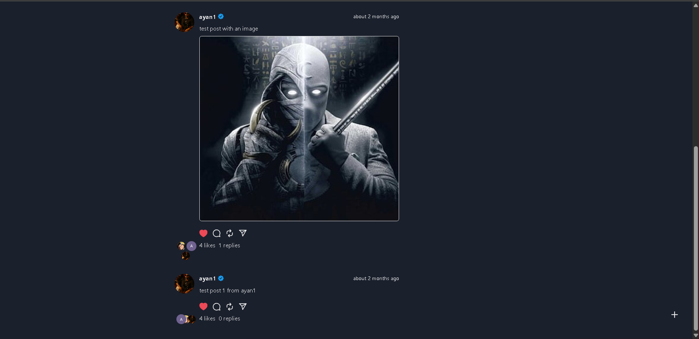
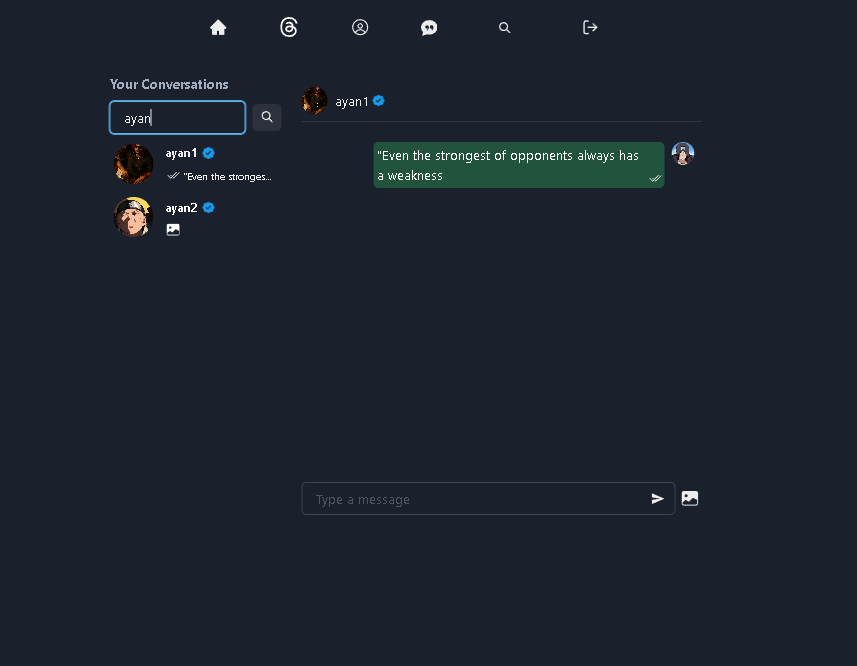
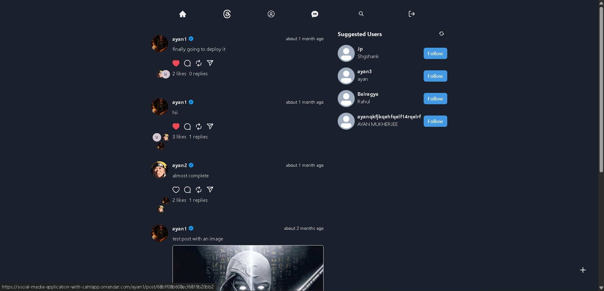
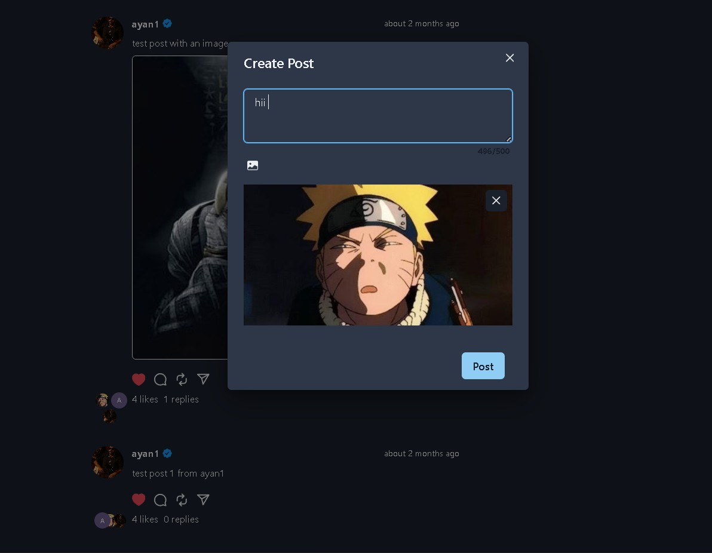
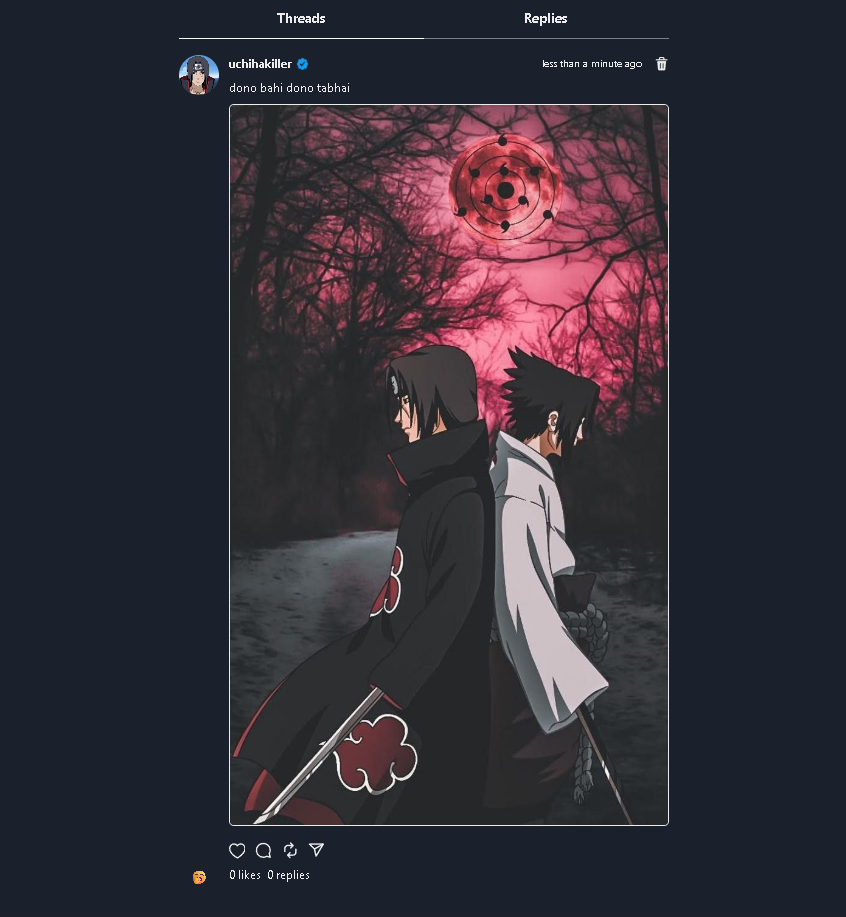
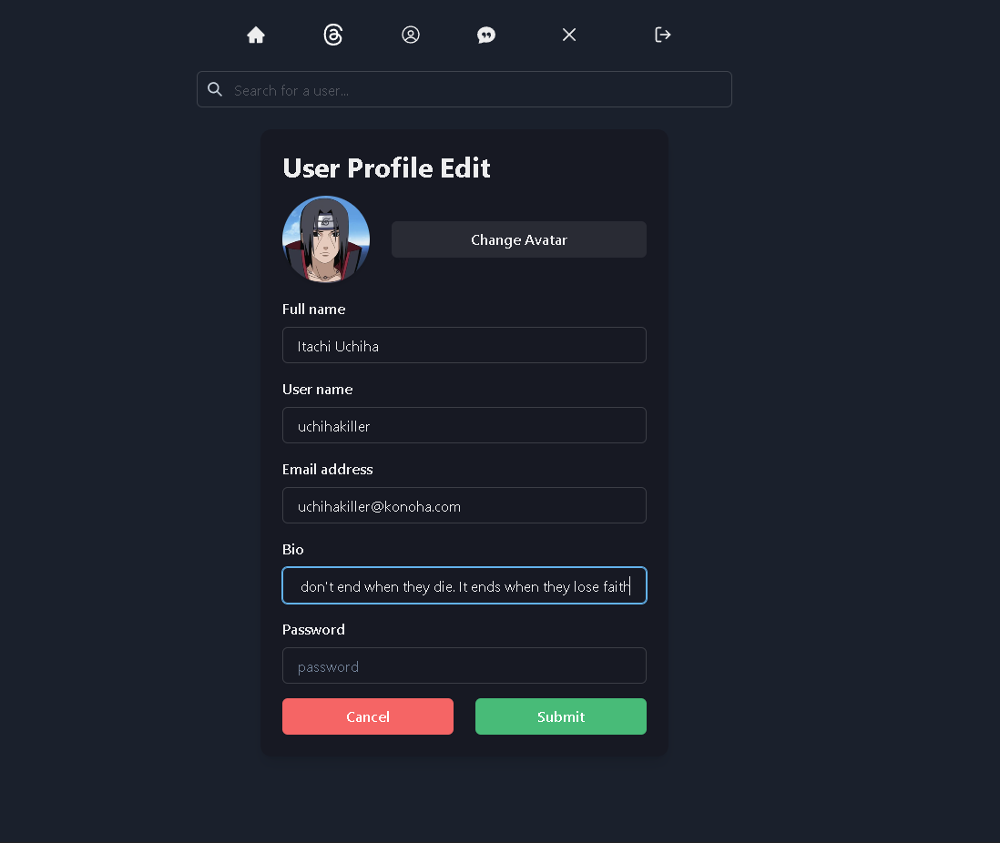

# MERN Social Media & Chat App

A full-stack **MERN** social media application with real-time chat, post creation, user profiles, and follow system. This project demonstrates authentication, protected routes, JWT, Recoil state management, and Socket.io integration.

---

## Features

- **Authentication & Authorization**
  - Sign up, log in, and logout
  - JWT-based protected routes
  - Cookie-based session handling

- **Social Media Functionality**
  - Create, edit, like, reply, and delete posts
  - Follow and unfollow users
  - View posts from followed users (Feed)
  - Suggested users to follow

- **User Profiles**
  - Update profile info
  - View your posts and other users' posts

- **Real-time Chat**
  - Private messaging between users
  - Online user indicator
  - Real-time message delivery and seen status with Socket.io

- **Frontend**
  - React + Vite + Chakra UI
  - Recoil for state management
  - Responsive design

- **Backend**
  - Node.js + Express
  - MongoDB for data storage
  - Cloudinary for image uploads
  - JWT for authentication
  - Protected routes for secured endpoints

---

## Screenshots

**Home Feed**  

**Chat Page**  

**Following Posts**  

**Single Post View**  

**Profile Posts**  

**Update Profile Page**  

---

## Highlights

- Real-time chat with Socket.io
- JWT authentication and cookie storage
- Fully protected API routes
- Responsive and modern UI
- Feed of posts from followed users
- Suggested users feature

---

Made with ❤️ by **Ayan**
